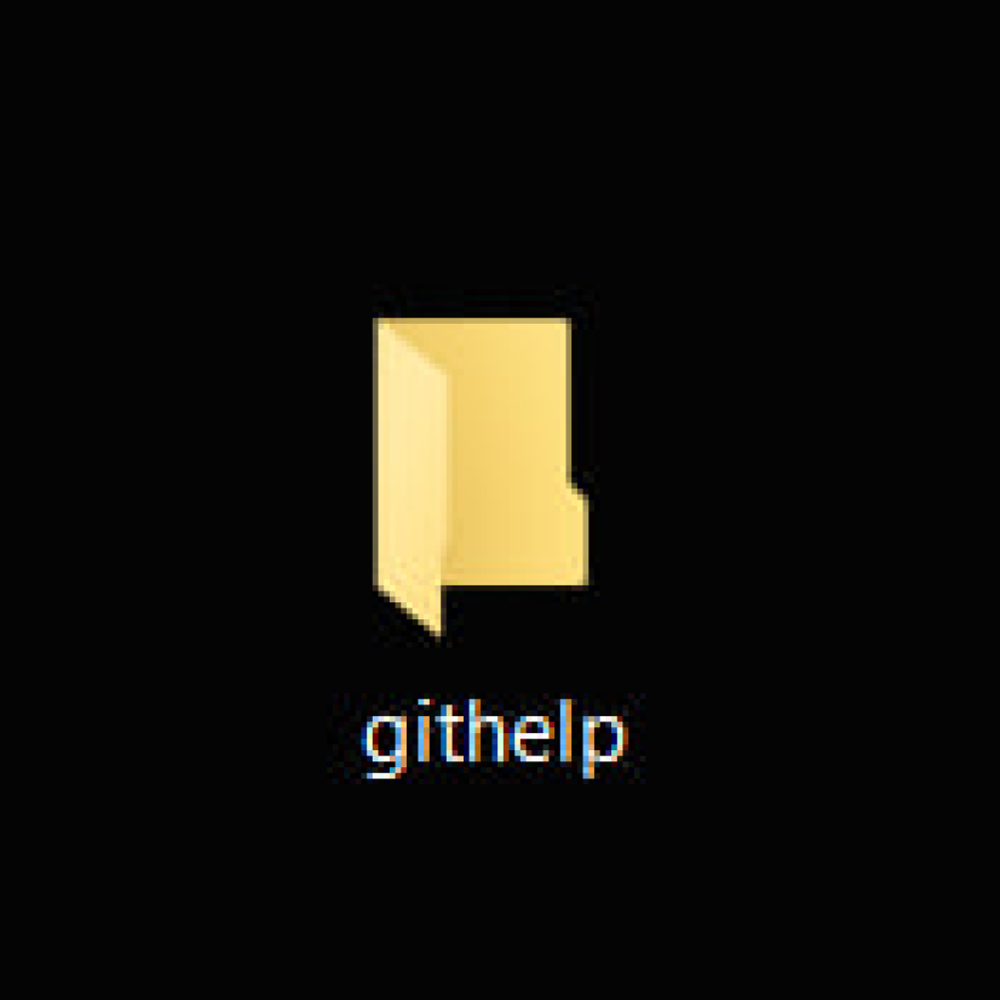
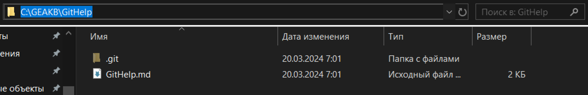

# Инструкция по GIT


Git (произносится «гит») — распределённая система управления версиями.
Проект был создан Линусом Торвальдсом для управления разработкой ядра Linux. Первая версия выпущена 7 апреля 2005 года.

## Работа с GIT

### Прежде всего нужно скачать Git.

[Ссылка на скачивание](https://git-scm.com/downloads).

### Как задать имя пользователя и адрес электронной почты
Имя пользователя нужно, чтобы привязывать коммиты к вашему имени. Это не то же самое, что имя пользователя учётной записи GitHub, с помощью которого выполняется вход в профиль на GitHub. Задать или изменить имя пользователя можно с помощью команды git config. Новое имя будет автоматически отображаться в последующих коммитах, отправленных на GitHub через командную строку. Если хотите скрыть своё реальное имя, можно использовать в качестве имени пользователя Git произвольный набор символов.
```sh 
git config --global user.name "Tara Routray"
```
Кроме того, командой git config можно изменять адрес электронной почты, привязанный к вашим коммитам Git. Новый адрес электронной почты будет автоматически отображаться во всех дальнейших коммитах, поданных на GitHub через командную строку.
```sh 
git config --global user.email "mail"
```
После вам нужно создать репозиторий, в котором вы будете работать.




Зайдите в командую строку после чего перейдите в нужную вам папку с помощью команды cd.

Адрес папки вы можете взять из проводника.



P.s. В этой ветке, в этом блоке я пытался сделать конфликт, но VS мне предлагает исправлять не в ком.стр., а тут.

## Команды
### Самое интересное! Разберем базовые команды для использования Git.


```sh 
1 git init
```
**Создать пустой репозиторий Git или вновь инициализировать существующий можно параметром init. При инициализации он создаст скрытую папку. В ней содержатся все объекты и ссылки, которые Git использует и создаёт в истории работы над проектом.**
```sh 
2 git add 
```
**Перед использвонием этой команды, не забываем сохранить наш файл, это команда позволяет гиту работать с исменениеями в файле.**
```sh 
3 git commit -m "something"
```
**Позволяет нам комитить (сохранять) версию нашего файла, не забываем писать сообщение, что именно было изменено в файле.**
```sh 
4 git log
```
**Позволяет нам посмотреть все версии.**
```sh 
git log --online
```
**Нумерация версий показывается нам в одну строчку.**


## Команды работы с ветками

```sh 
git branch
```
Информация по веткам
```sh 
git branch (name_of_branch)
```
Создать ветку
```sh 
git checkout master
```
Перейти в мастер ветку
```sh 
git branch -d (name_of_branch)
```
Удалить
```sh 
git log -graph 
```
Информация по веткам + "Инфорграфика"
```sh 
git merge (name_of_branch)
```
Заливаются в ветку где вы находитесь

## Обучение pull request
* Делаем fork репозитория, в которой потом хотим сделать pull request.
* Выполняем команду клонирования из своей fork-копии
```sh 
git clone git@github.com:*YOURE_GITHUB*/version_control.git
```
* Создаем новую ветку и вносим необходимые изменения в файл
```sh 
git checkout -b updatereadme
vim README.md
git add README.md
git commit -m "Добавили инструкцию как создать pull request"
```
* Делаем push
```sh 
git push --set-upstream origin updatereadme
```
* Переходим на свою страницу репозитория. Выбираем ветку updatereadme и жмем кнопку Compare & pull request
* Что бы сделать push от другого пользователя необходимо выполнить команду


```sh 
GIT_SSH_COMMAND='ssh -i ~/.ssh/user-private-key -o IdentitiesOnly=yes' git push git@github.com:gulden-geekbrains/version_control.git
```
вместо user-private-key подставьте свой ключ

*Можно прописать настройки для подсоединения по ssh
```sh 
git config remote.origin.url git@github.com:gitusername/reponame
git config core.sshCommand "ssh -i ~/.ssh/user-private-key -o IdentitiesOnly=yes"
```